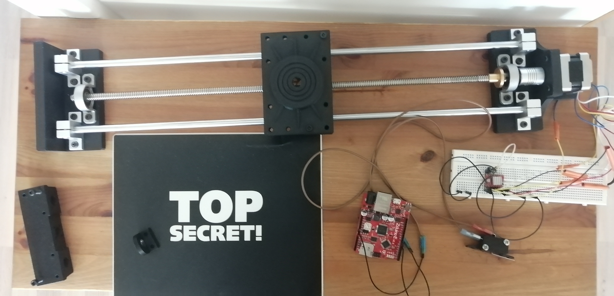
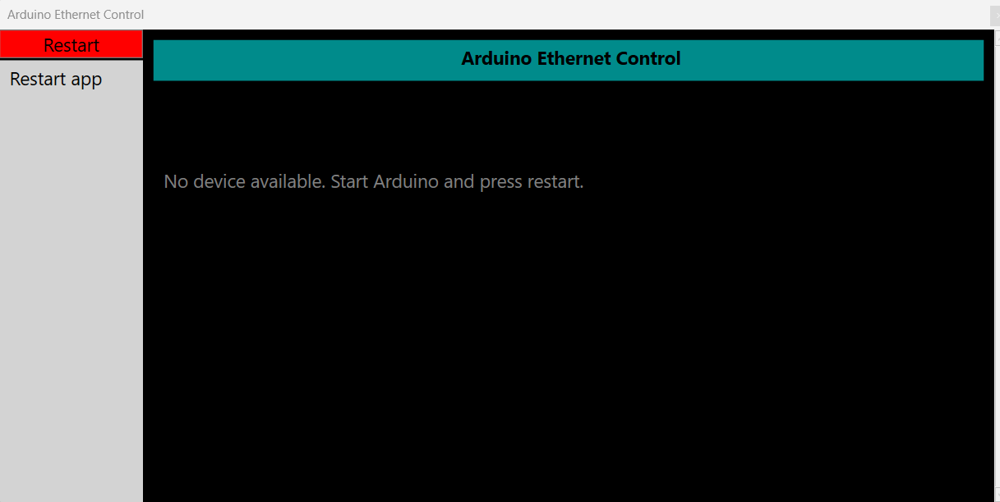
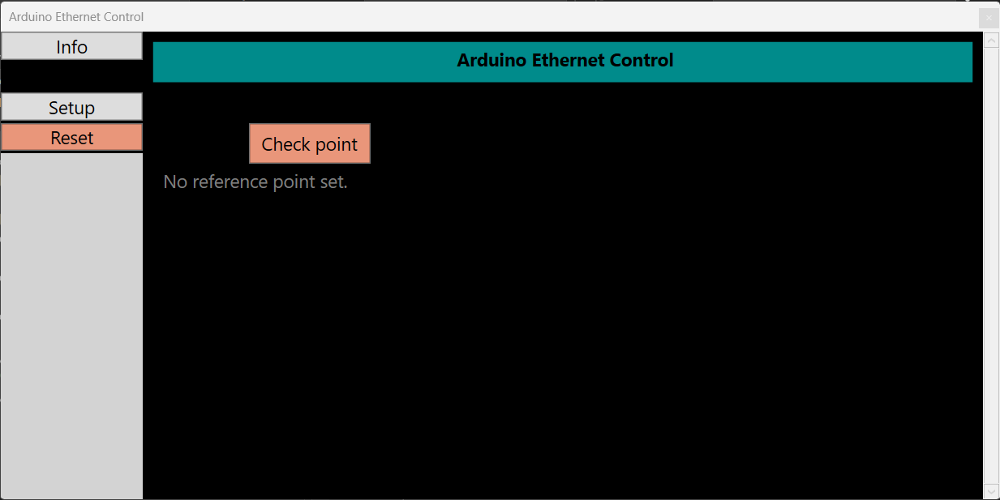
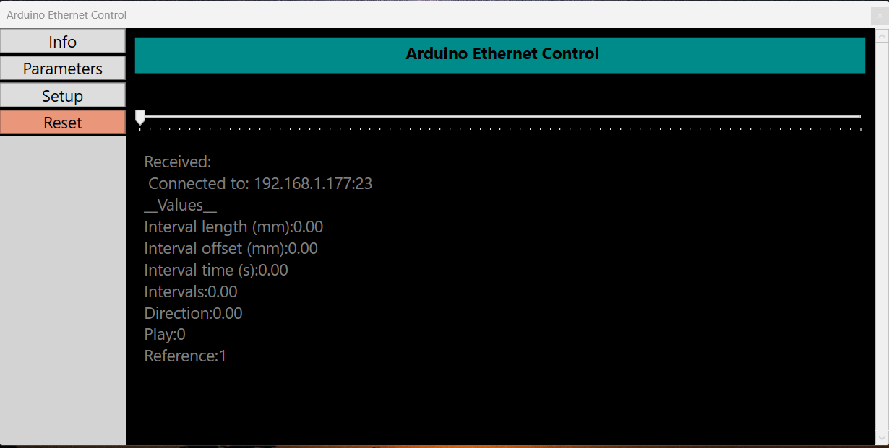
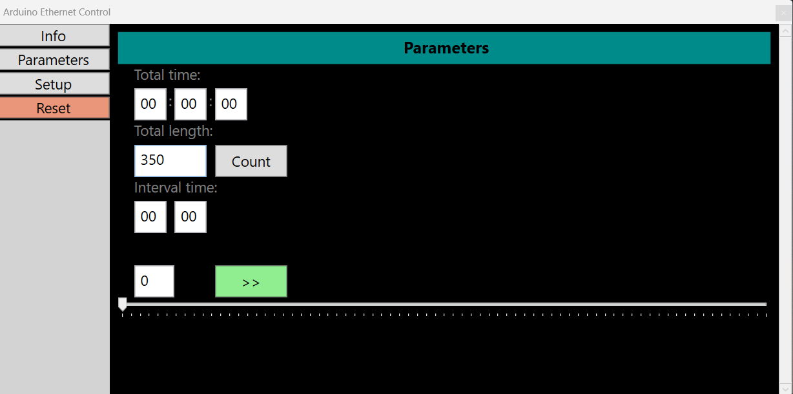
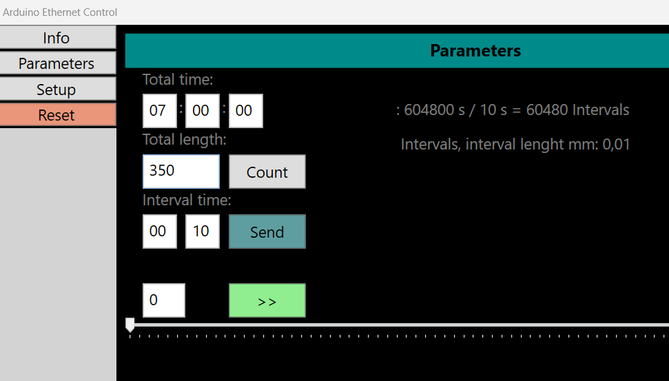
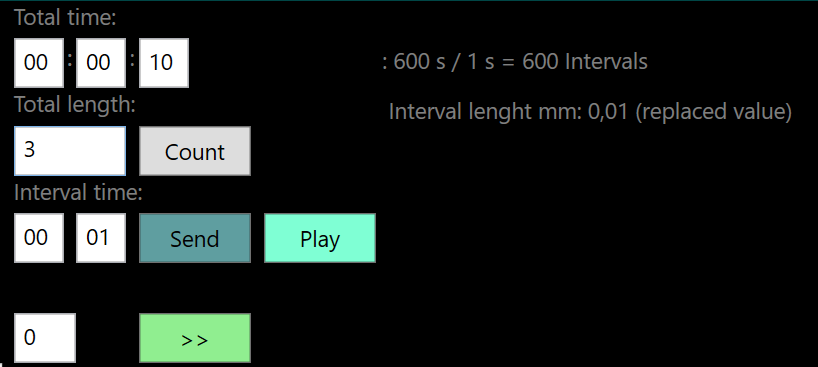
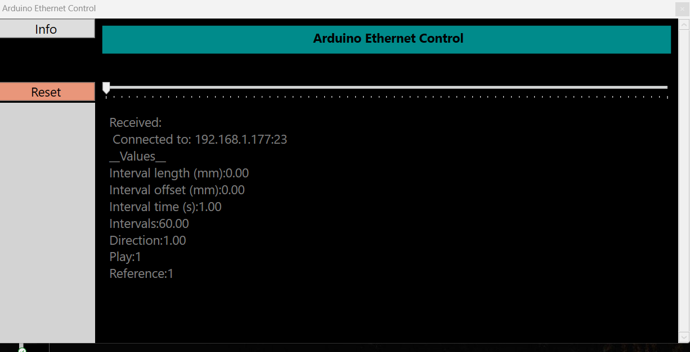

# Arduino project page

### Project description

The purpose is to move the camera on the rail in intervals. The necessary parameters are provided in the Windows application and sent to the device via ethernet.

### Equipments

- [x] Arduino Uno
- [x] A4988 Driver
- [x] Stepper motor 39BYGH 405B
- [x] Rail
- [x] Limit switches 

### Requirements

- Start of the process possible at both ends of the rail
- Determination of...
  - interval lenght
  - interval time
  - direction
  - start position
  - start and end condition
- Pause, stop and reset process if need
- Also check of the start and end points before set values. 

I'll add some images and code during the process...

### Interface

The operation of the interface is partly based on the facts that:
- Only functions that are allowed will be enabled.
  - App ask restart if arduino is not available.
  - Before user can start anything device need to run to the reference point
  - User are allowed send a data only when fields are filled.
- Only the info button is always enabled and it will return current state.

I think that I will add run to reference point button because now arduino will check it automaticly. 
The problem is that so long it is drive towards reference point in loop app can't connect it.
Maybe I give a little thought first how to handle it...

#### Requirements of app

- All TextBoxes must be filled (zero if neccessary)
- Stop or reset
- Direction change and offset
- Some info print (request response)
- Send and recive the data in arduino
- User must be able to drive sledge to reference point

### Links

All the codes are available in these links.

[WPF app](https://github.com/temppase/ArduinoControlProtoApp)

[Arduino code](https://github.com/temppase/ArduinoUnoTest/blob/main/source/UnoServer.ino)

I start to build arduino code in the basic chat server example but turned it totaly something else. 

### Notes

When app starts it's first try to ping arduino to check if it's available. After that it will fetch a information about the current state of device.

### ToDo

- [x] Complete the limit switch code.
- [x] Tests
- [ ] Assemly and parts (Comming...)

