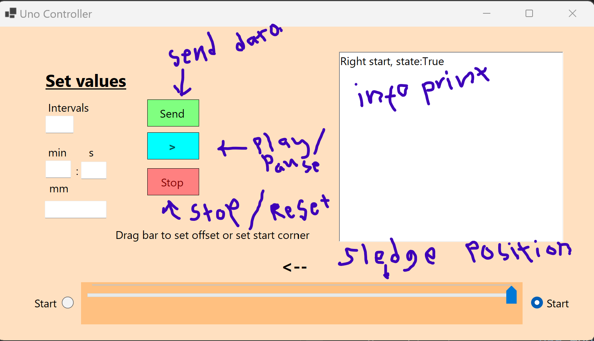

# Arduino project page

### Project description

The purpose is to move the camera on the rail in intervals. The necessary parameters are provided in the Windows application and sent to the device via ethernet.

### Equipments

- [x] Arduino Uno
- [x] A4988 Driver
- [x] Stepper motor 39BYGH 405B
- [x] Rail
- [x] Limit switches 

### Requirements

- Start of the process possible at both ends of the rail
- Determination of...
  - interval lenght
  - interval time
  - direction
  - start position
  - start and end condition
- Pause, stop and reset process if need
- Also check of the start and end points before set values. 

I'll add some images and code during the process...

### Interface


The operation of the interface is partly based on the facts that:
- Only functions that are allowed will be enabled.
  - User are allowed send a data only when fields are filled.
  - The play button is enabled when the send button is clicked. The slider and the check buttons are disabled when the send button is pressed.
  - After the play click button changes to the pause.
  - After pause clicked the stop button enabled and it will reset parameters and enable the slider and the check buttons.
- Only the info button is always enabled and it will return current state.
- The white screen will tell user current state.

I think that I will add run to reference point button because now arduino will check it automaticly. 
The problem is that so long it is drive towards reference point in loop app can't connect it.
Maybe I give a little thought first how to handle it...

#### Requirements of app

- All TextBoxes must be filled (zero if neccessary)
- Play and pause (toggle button)
- Stop or reset
- Direction change and offset
- Some info print (request response)
- Send and recive the data in arduino 

### Links

[WinForm app](https://github.com/temppase/ArduinoControlApp)

[Arduino code](https://github.com/temppase/ArduinoUnoTest/blob/main/source/UnoServer.ino)

I start to build arduino code

### Notes

- Project isn't ready yet but I believe it will be complete in the first week of July.
- Stepper motor drive about 2,25 mm out of the start point. That will cause zero point move if not drive back to limit switch.

### ToDo

- [x] Complete the limit switch code.
- [ ] Tests
- [ ] Assemly and parts

```cpp

  // Set the spinning direction counterclockwise (back to zero point):
  digitalWrite(dirPin, LOW);

  // 7 is limit switch pin...:
  while (digitalRead(7) != 0) {
    digitalWrite(stepPin, HIGH);
    delayMicroseconds(1000);
    digitalWrite(stepPin, LOW);
    delayMicroseconds(1000);
  }

```

I think I will use this kind code to reference point.
```cpp

  // Set the spinning direction counterclockwise (back to zero point):
  digitalWrite(dirPin, LOW);
  if(limitSwitch.getState() != 0){
      // 7 is limit switch pin...:
    while (true) {
      digitalWrite(stepPin, HIGH);
      delayMicroseconds(1000);
      digitalWrite(stepPin, LOW);
      delayMicroseconds(1000);
    }
  }


```

This might be another option but I think that the first one is OK.
